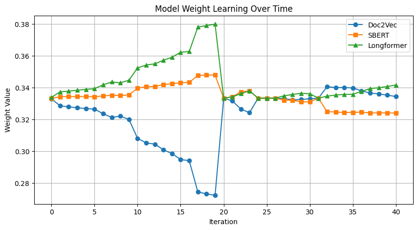

# 🧠 Legal Case Similarity using Embedding Interpolation + Feedback Diffusion

This project aims to measure the similarity between legal case documents using a hybrid ensemble of three powerful embedding models: **Doc2Vec**, **SBERT**, and **Longformer**. The final similarity matrix is adaptively tuned using expert feedback from lawyers, allowing the model to learn more aligned and meaningful representations of legal case similarity.

---

## 📊 Sample Output

The graph below shows how the weights of each model (Doc2Vec, SBERT, Longformer) change over time as the system adapts based on human (lawyer) feedback:



---

## 📁 Dataset

- `fully_cleaned_legal_cases.csv`: Cleaned legal text data.
- `Untitled spreadsheet - Sheet1.csv`: Lawyer-annotated similarity scores between pairs of cases.

---

## 🔧 Models Used

- **Doc2Vec** (from `gensim`) for shallow semantic embedding.
- **SBERT** (`sentence-transformers/all-MiniLM-L6-v2`) for rich semantic sentence-level understanding.
- **Longformer** (`allenai/longformer-base-4096`) for capturing long-range dependencies in lengthy legal documents.

---

## 🛠️ Installation

Run the following to install the necessary dependencies:

```bash
pip install numpy scipy gensim sentence-transformers transformers torch pandas matplotlib scikit-learn
